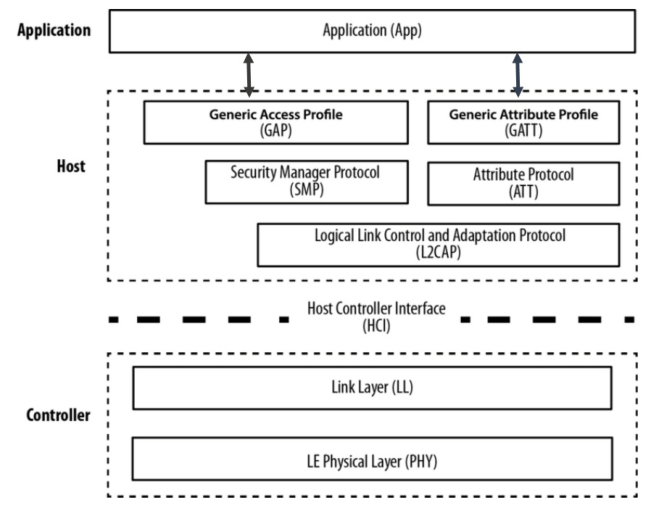
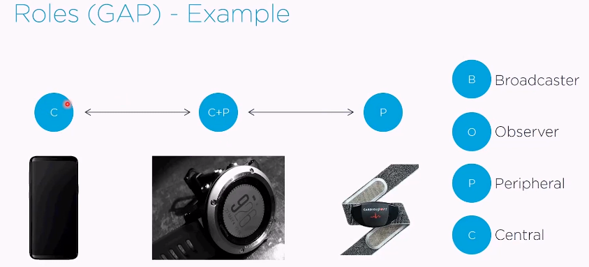
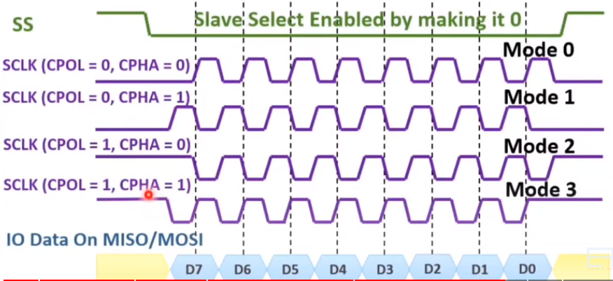
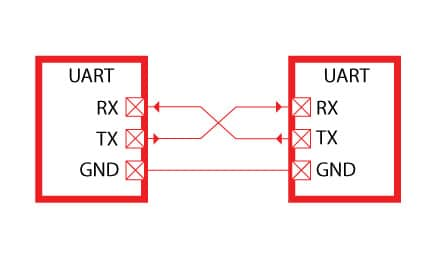

# Communication Protocols

---

## Bluetooth Low Energy (BLE)

---

********************************************************************************************************Bluetooth Low Energy is a wireless PAN communication protocol designed for short-range communication between devices while consuming minimal power. It is designed and maintained by the Bluetooth Special Interest Group (SIG)******************************************************************************************************** 

**BLE is ideal for applications that:**

- Transfer **small amounts of data in short bursts**
- Transfer data at **lower speeds**
- Require **low power** consumption (battery powered devices)
- Typically **short range communication**
- Could utilize a connection to a **smartphone**

### Advantages and Disadvantages

**********************Advantages:**********************

- Lower power consumption compared to other low-power wireless technologies
- No cost to access official specification documents
- Low cost of modules and chipsets
- Low cost of licensing and certification
- 100% support in smartphones

****************************Disadvantages:****************************

- **Data throughput**: raw data transfer ranges from 250 Kbps to 2 Mbps
- **Range**: Originally designed for short-range communication
- Gateway requirement for internet connectivity (???)

### BLE Protocol Stack | System Architecture

---

BLE protocol stack architecture consists of three main parts, the Application Layer, the Host Layer, and the Controller Layer:



### The Application Layer

---

Manages application-specific functionalities and profiles for organized data exchange between devices

- BLE profiles, such as Generic Attribute Profile (GATT), Battery Service, and Heart Rate Service, operate within the Application Layer, defining how devices interact in specific use cases.
    - BLE profiles implement a specific application and describe how two or more devices can **discover and communicate with each other**

### The Host Layer

---

Oversees higher-level control and processing tasks

Components include:

- **Generic Access Profile (GAP):** Defines procedures for device discovery, connection, and link management.
- **Generic Attribute Profile (GATT):** Describes data organization and exchange, serving as a foundation for other profiles.
- **Attribute Protocol (ATT)**: Specifies the communication protocol for data exchange between devices, facilitating the transfer of attribute-based information.
- **Logical Link Control and Adaptation Protocol (L2CAP**): Enables segmentation and reassembly of data packets, ensuring efficient communication between devices in the Host Layer.
- **Security Manager Protocol (SMP)**: Defines protocol for pairing and key distribution

### GAP Roles

---

| GAP Role | Associated Link Layer State | Description |
| --- | --- | --- |
| Peripheral | Advertising State | The device advertises its presence and services, waiting for a connection request from a central device. |
| Central | Scanning and Initiating States | The device actively scans for advertising peripherals and initiates a connection to a selected peripheral. |
| Observer | Scanning State | The device monitors advertising peripherals but does not establish connections. It collects information about nearby devices without initiating connections. |
| Broadcaster | Advertising State | The device periodically advertises its presence and information but does not establish connections. |
| Mesh Node | Advertising, Scanning, or Connected States | In a BLE mesh network, a device may take on roles like Advertising, Scanning, or Connected, depending on its function in the mesh topology. |
- **Example GAP Roles**
    
    
    

### **Pairing and Bonding**

---

**When a BLE connection is initially established, it operates without security by default.**

- **Pairing** is the process of establishing a secure connection between two BLE devices. During pairing, devices exchange information and generate shared secret keys used for encryption and authentication.
    - Authentication provides assurance that the devices communicating are legitimate and authorized.
    
    | Pairing Method | Description | Security Level |
    | --- | --- | --- |
    | Just Works | Devices automatically exchange keys. | Low |
    | Passkey Entry | Users manually enter a numeric passkey. | Moderate |
    | Numeric Comparison | Users verify matching numeric values. | High |
    | Out of Band (OOB) | External method (e.g., NFC) for key exchange. | Very High |
- **Bonding** occurs after pairing and involves storing the shared secret keys obtained during pairing for later use. Bonding enables devices to remember each other, simplifying the reconnection process in subsequent sessions.
    - Enhances the user experience by allowing devices to establish secure connections without repeating the pairing process.
- **Encryption** ensures the confidentiality of data during transmission by encoding it in a way that is only decipherable by devices with the appropriate keys.
    - During pairing, devices exchange keys that are later used for encryption.
    - The encryption process can use a combination of symmetric and asymmetric encryption techniques.
- **LE Secure Connections** is a security feature in BLE that enhances pairing by employing stronger cryptographic algorithms, public key cryptography, and protection against man-in-the-middle attacks. It provides a very high level of security, especially in scenarios requiring enhanced protection, such as financial transactions or healthcare applications.

### The Controller Layer

---

Manages lower-level radio communication and signal transmission

Components include:

- **Link Layer (LL):** Handles connection establishment, maintenance, and termination.
- **LE Physical Layer (PHY):** Manages the physical transmission of data through radio frequency communication.
- **HCI (Host Controller Interface):** Provides an interface between the Host and Controller Layers, allowing for communication between the software and hardware components.

---

### BLE vs. Classic Bluetooth

---

- BLE was introduced in Bluetooth version 4.0 (2010)
- LE Audio was released last year and will likely replace classic Bluetooth

| Feature | Bluetooth Low Energy (BLE) | Classic Bluetooth |
| --- | --- | --- |
| Usage | IoT devices, wearables, health and fitness gadgets, smart sensors | Audio streaming, file transfer, peripherals, hands-free devices |
| Data Rate | Low to moderate (ranging from 1 Kbps to 2 Mbps). Mandatory 1M PHY (1Mbps data rate minimum, meaning that all BLE devices must support this data rate to ensure interoperability.) | Higher data rates (up to 3 Mbps) |
| Power Consumption | Very low power consumption, designed for battery-operated devices | Higher power consumption, more suitable for devices with larger power budgets |
| RF Channel Spectrum | Uses the 2.4 GHz ISM band (this band is unlicensed and anyone can use), 40 channels spaced 2 MHz apart | Uses the 2.4 GHz ISM band, 79 channels spaced 1 MHz apart |
| Device Discovery | Faster device discovery due to shorter connection setup time | Slower device discovery due to more complex connection setup |
| Audio Streaming | Not ideal for continuous high-quality audio streaming | Suitable for high-quality audio streaming, supports Advanced Audio Distribution Profile (A2DP) |
| Range | Short range, typically up to 10 meters | Longer range, can extend up to 100 meters or more depending on the class |
| Topology | Supports star, mesh, and point-to-point topologies | Supports point-to-point and point-to-multipoint topologies |

### BLE Advertising

---

BLE advertising is a mechanism for devices to **broadcast their presence and capabilities** to nearby devices, **facilitating connection initiation**.

**Advertising Types:**

| Advertising Type | Description |
| --- | --- |
| Connectable Advertising | Invites devices to establish a connection. |
| Non-Connectable Advertising | Disseminates information without the intention of establishing a connection. |
| Scannable Advertising | Allows devices to be discovered during a scan. |
| Directed Advertising | Targets a specific device for connection establishment. |
- **Advertising Data:**
    - **Payload:** Limited data payload (31 bytes) for conveying information.
    - **Format:** Structured using Advertising Data and Scan Response Data fields.

- **Advertising Interval:**
    - **Definition:** The time between consecutive advertising events.
    - **Range:** Typically adjustable, ranging from a few milliseconds to several seconds.

- **Advertising Channels:**
    - **Frequency:** Utilizes three advertising channels (**37, 38, 39, these are the least active channels for Wi-F**) in the 2.4 GHz ISM band.
    - **Cyclic Channel Selection:** Minimizes interference by cycling through channels.
    
- **Advertising States:**
    
    
    | Advertising State | Description |
    | --- | --- |
    | Advertising State | Device actively transmits advertising packets. |
    | Scanning State | Device listens for advertising packets from other devices. |
- **Use Cases:**
    - **Device Discovery:** Enables nearby devices to discover and connect.
    - **Beacon Technology:** Commonly used in beacons for location-based services.
    - **Peripheral Role:** Essential for devices operating in the peripheral role.

### **BLE Direction Finding**

---

- **Introduction:**
    - **Purpose:** BLE Direction Finding is a feature introduced in Bluetooth specifications to enable precise location awareness and positioning of BLE devices.
    - **Enhanced Location Services:** It enhances location-based services by providing accurate directional information, making it suitable for applications like asset tracking, indoor navigation, and proximity-based interactions.
- **Angle of Arrival (AoA) and Angle of Departure (AoD):**
    - **AoA:** In AoA, the receiving device determines the angle from which the BLE signal is transmitted. This is valuable for locating the source of a signal with high accuracy.
    - **AoD:** In AoD, the transmitting device shares information about the direction of its signal. This is useful when the transmitting device needs to be located.
- **Use Cases:**
    - **Asset Tracking:** BLE Direction Finding can be employed to precisely track the location of assets in real-time within a defined space.
    - **Indoor Navigation:** Enables more accurate indoor navigation, especially in complex environments like shopping malls or large facilities.
    - **Proximity Services:** Enhances proximity-based services by providing detailed spatial information about nearby BLE devices.
- **Implementation:**
    - BLE Direction Finding is typically implemented using an array of antennas on both the transmitting and receiving devices. By measuring the signal arrival or departure angles, the relative position of devices can be calculated.
- **Bluetooth SIG Specifications:**
    - BLE Direction Finding features are specified in Bluetooth Core Specification version 5.1 and later. Devices supporting these specifications can participate in direction-finding operations.

## **I2C (Inter-Integrated Circuit) Protocol**

---

**I2C**, or Inter-Integrated Circuit, is a popular HALF DUPLEX **serial communication protocol** used for connecting multiple electronic devices together on the same bus. 

**Maximum Speed (Baud rate):**

1. **Standard Mode:** 100 kbps (kilobits per second)
2. **Fast Mode:** 400 kbps

Less Common Modes:

1. **Fast Mode Plus (Fm+):** 1 Mbps (megabits per second)
2. **High-Speed Mode:** 3.4 Mbps

**Number of Wires and Pull-Up Resistors:**

I2C typically uses **two wires (COMMONLY PULLED UP TO 5V)**:

- **SDA (Serial Data Line):** This is used for data transmission between devices.
- **SCL (Serial Clock Line):** This carries the clock signal used for synchronization.

**Addressing Devices:**

I2C supports (most commonly) **7-bit addressing**, allowing you to connect multiple devices on the same bus. With 7-bit addressing, you can address up to **128 devices** (0x00 to 0x7F). 

**Master and Slave Communication:**

In the I2C protocol, devices can take on two primary roles:

- **Master:** The master initiates communication, generates the clock signal, and addresses the slave devices. Masters control the flow of data on the bus.
- **Slave:** Slaves respond to the master's commands and can send or receive data as instructed. Multiple slave devices can be connected to the same bus.

**Multi-Master/Multi-Slave Configuration**

1. **Multi-Master Configuration:**
    - Multi-master configurations are more complex to manage, as they require a mechanism for arbitrating access to the bus when multiple masters attempt to communicate simultaneously.
    - The specific number of masters that can coexist on the bus depends on the hardware and the bus capacitance. However, in practice, multi-master configurations typically involve a small number of masters (e.g., 2 or 3).
2. **Multi-Slave Configuration:**
    - The number of slave devices that can be connected to the bus is determined by the addressing scheme (7-bit or 10-bit) and the available unique addresses.
    - In 7-bit addressing, there can be up to 128 unique slave addresses (though some are reserved).
    - In (LESS COMMON) 10-bit addressing, there can be up to 1,024 unique slave addresses.

**Data Transfer:**

Data transfer in I2C is done through a series of **start**, **address**, **data**, and **stop** conditions. Here's a basic overview of a data transfer sequence:

1. **Start Condition:** The master initiates communication by sending a start condition. The start condition is usually a single 0 bit (because SDA and SCL are commonly pulled UP)
2. **Addressing:** The master sends the address of the target slave device along with the read/write bit (R/W). The R/W bit indicates whether the master intends to read from (1) or write to (0) the slave.
3. **Data Transfer:** Data is sent between the master and slave in a synchronized manner. Either the master or slave can send or receive data based on the R/W bit.
4. **Stop Condition:** The master sends a stop condition when the data transfer is complete. The stop condition is usually a single 0 bit (because SDA and SCL are commonly pulled UP)


**When to Use I2C:**

I2C is suitable for scenarios where you need to connect multiple devices on a bus and require a moderate data transfer rate. It's commonly used for:

- **Sensors and Modules:** Many sensors, displays, and peripherals support I2C communication, making it a good choice for connecting these devices to a microcontroller.
- **Interfacing with ICs:** I2C is often used for configuration and communication with integrated circuits (ICs), such as EEPROMs, ADCs, DACs, and real-time clocks (RTCs).

I2C's simplicity and wide support in various microcontrollers make it a preferred choice for many embedded systems.

- **Code Example (Python):**
    
    ```python
    import smbus  # Import the SMBus module for I2C communication
    
    # Create an I2C bus instance (usually 0 or 1, depending on the hardware)
    i2c_bus = smbus.SMBus(1)
    
    # Define the I2C address of the target device
    device_address = 0x68
    
    # Read data from a register on the I2C device
    data = i2c_bus.read_byte_data(device_address, 0x0A)
    
    # Write data to a register on the I2C device
    i2c_bus.write_byte_data(device_address, 0x0B, 0x42)
    ```
    
    - In the example above, **`0x0A and 0x0B`** are memory register addresses on the I2C device. **These values indicate the specific register from which data is being read or written.**
    - `0x42` represents the data that is being written to the specified register address **`0x0B`**.

## **SPI (Serial Peripheral Interface)**

---

**SPI (Serial Peripheral Interface)** is a widely used synchronous serial communication protocol in embedded systems. It is often chosen for its simplicity and high-speed data transfer capabilities. SPI is commonly used to connect microcontrollers, sensors, memory devices, and other peripherals. 

**SPI HAS NO DATA ACKNOWLEDGMENT!!!**

**Wiring:**

- **Number of Wires:** SPI typically uses four wires, but can have more depending on the configuration:
    - **SCLK (Serial Clock):** This clock signal synchronizes data transmission between the master and slave devices.
    - **MISO (Master In Slave Out):** Data is transmitted from the slave to the master on this line.
    - **MOSI (Master Out Slave In):** Data is transmitted from the master to the slave on this line.
    - **SS/CS (Slave Select/Chip Select):** This signal is used to enable or select a specific slave device for communication in multi-slave setups. THERE NEEDS TO BE ON SS/CS WIRE FOR EACH SLAVE (this can be a disadvantage if there are many slaves)
- **Pull-Up/Pull-Down Resistors:** Pull-up or pull-down resistors are commonly used with SPI signals, especially SS/CS, to ensure that unselected slave devices maintain a defined state when not active.

**Maximum Baud Rate/Bandwidth:**

SPI can support very high data transfer rates, often in the MHz or even tens of MHz range. The actual maximum baud rate depends on the specific microcontroller or device and its SPI capabilities.

**Number of Devices:**

SPI can support multiple devices on the same bus. Each slave device has its SS/CS line, allowing the master to select and communicate with a specific slave at a time. This makes SPI suitable for multi-device setups.

**Single-Master/Multi-Slave:**

SPI primarily operates in a single-master, multi-slave configuration. 

**Data Transfer:**

- **Read:** The master sends clock pulses while reading data from the selected slave. The slave sends data on the MISO line, which the master reads.
- **Write:** The master sends clock pulses while writing data to the selected slave. The master transmits data on the MOSI line, which the slave reads.

**When to Use SPI:**

Use SPI in the following scenarios:

- When you need high-speed data transfer with low protocol overhead.
- When connecting multiple devices to a single master.
- When devices require full-duplex communication (simultaneous send and receive).

**Clock Polarity (CPOL) and Clock Phase (CPHA)**



Clock polarity (CPOL) and clock phase (CPHA) are **configuration parameters** that **determine the timing and synchronization of data transmission between the master and slave devices**. These parameters define when data is sampled and when it is changed on the SPI bus.

**Clock Polarity (CPOL):**

- CPOL determines the idle state of the clock signal (SCLK) when no data transfer is occurring.
- It has two possible settings:
    1. **CPOL=0:** The clock signal is idle low, meaning it sits at a logic low level (0) when not in use.
    2. **CPOL=1:** The clock signal is idle high, meaning it sits at a logic high level (1) when not in use.

**Clock Phase (CPHA):**

- CPHA determines when data is sampled or changed concerning the clock signal.
- It has two possible settings:
    1. **CPHA=0:** Data is sampled on the leading edge (rising edge) of the clock signal. Data is changed on the trailing edge (falling edge).
    2. **CPHA=1:** Data is sampled on the trailing edge (falling edge) of the clock signal. Data is changed on the leading edge (rising edge).
- **CPOL & CPHA Summary**
    1. **CPOL=0, CPHA=0:** Clock is idle low, and data is sampled on the rising edge (leading edge) of the clock.
    2. **CPOL=0, CPHA=1:** Clock is idle low, and data is sampled on the falling edge (trailing edge) of the clock.
    3. **CPOL=1, CPHA=0:** Clock is idle high, and data is sampled on the rising edge (leading edge) of the clock.
    4. **CPOL=1, CPHA=1:** Clock is idle high, and data is sampled on the falling edge (trailing edge) of the clock.

## SPI vs. I2C

---

| Parameters | I2C | SPI |
| --- | --- | --- |
| # of Wires (I2C) | 1. SDA 
2. SCL  | 1. MOSI 
2. MISO
3. SCLK
4. SS/CS |
| Communication (SPI) | Half Duplex | Full Duplex |
| Configuration (I2C) | Multiple Master/Multiple Slave | Single Master/Multiple Slave |
| Speed (SPI) | Slower (400kbps max) | Faster (10 Mbps max) |
| Start & Stop Bits (SPI) | Required | Not Required |
| Data Acknowledgments (I2C) | Required | Not required |
| Redundant Data (SPI) | Required (start + stop + address) | Not required |
| Cost (I2C) | low cost (only two wire configuration) | costly (MINIMUM four wire configuration - one CS per slave) |
| IO Constraint (SPI) | Pull-Up Resistor connected to Vcc | Not Required |
| Addressing  | 7-bit addressing | Chip select wire  |
| Power Consumption (SPI) | Bit High (pull-up resistor) | Low |
| Plug & Play (I2C) | Yes | No (need to set configuration parameters CPOL and CPHA) |
| Communication Distance  | On Board (SHORT) | On Board (SHORT) |

## UART (Universal Asynchronous Receiver Transmitter)

---

Universal →This protocol can be applied to any receiver and transmitter

Asynchronous →This protocol does not use a clock signal to synchronize data ]

For successful data exchange, the transmitter and the receiver must agree on the following parameters:

- **Baud Rate** (9600bps most common)
- **Data Bits** (Following the start bit, the transmitter sends the configured number of data bits (e.g., 8 bits) one at a time, least significant bit (LSB) first. These bits represent the actual data being transmitted.)
- **Parity** - Optional (The parity bit is calculated based on the data bits and the selected parity mode (even or odd) This is for ERROR CHECKING.)
- **Stop Bit**

**Wiring and Pins:**

- UART typically uses two wires:
    1. **TX (Transmit):** Sends data from the transmitter (usually the microcontroller) to the receiver.
    2. **RX (Receive):** Receives data by the receiver (the other microcontroller or device).
- While UART doesn't require pull-up or pull-down resistors, they can be added for signal integrity, especially in long-distance communication.

**Maximum Baud Rate/Bandwidth:**

- The maximum baud rate depends on the hardware's capabilities but can range from **300 bps (bits per second) to several Mbps (megabits per second)**, depending on the hardware and distance.

**Point-to-Point:**

- UART is typically point-to-point communication between two devices: a transmitter and a receiver. However, UART can be used in multi-drop configurations with one transmitter and multiple receivers.

**Data Transfer:**

- UART sends data as a series of bits, typically 8 data bits with optional parity and a stop bit(s). The format is often 8-N-1, indicating 8 data bits, no parity, and 1 stop bit.
- Data is sent asynchronously, with both the transmitter and receiver using the **same baud rate for synchronization.**
- UART communication is full-duplex, allowing data to be transmitted and received simultaneously.

**When to Use UART:**

- UART is suitable for simple and point-to-point or multi-drop communication between two or more devices.
- It's commonly used for basic serial communication, debugging, and connecting microcontrollers to sensors, displays, and other embedded devices.
- UART's simplicity and low overhead make it ideal for applications where high-speed data transfer or complex protocols are not required.
- **Example UART Communication in Python (Using pySerial):**
    
    ```python
    import serial
    
    # Create a serial port object (adjust port and baud rate as needed)
    ser = serial.Serial('COM1', baudrate=9600)
    
    # Sending data (transmitter)
    ser.write(b'Hello, UART!')
    
    # Receiving data (receiver)
    received_data = ser.readline()
    print(received_data)
    
    # Close the serial port
    ser.close()
    ```
    



## USB (Universal Serial Bus)

---

**Wires and Connections:**

USB typically uses four wires for communication:

1. **VCC (Voltage):** Power supply for the connected device.
2. **D+ and D- (Data Lines):** These differential data lines transmit and receive data between the host and the device.
3. **GND (Ground):** Provides a common ground reference for electrical signals.

D+ and D- signals are used in USB communication to implement a differential signaling scheme. When these two signals are sent to a differential amplifier, their difference is amplified (D+ - (D-) = 2D). Since noise is unpredictable (and thus will not be perfectly mirrored), the noise amplification is less than the signal amplification. This results in an improved Signal-to-Noise Ratio (SNR) 

**Maximum Baud Rate/Bandwidth:**

USB data transfer rates vary depending on the USB specification and generation:

- **USB 1.0 and 1.1:** Low-speed (1.5 Mbps) and full-speed (12 Mbps).
- **USB 2.0:** High-speed (480 Mbps).
- **USB 3.0:** SuperSpeed (5 Gbps).
- **USB 3.1 and 3.2:** SuperSpeed+ (10 Gbps and 20 Gbps, respectively).
- **USB 4.0:** SuperSpeed+ (20 Gbps).

**Addressing Devices:**

In USB, devices are addressed by assigning them unique device addresses. USB supports up to 127 devices on a single USB bus, including the host.

**Communication Mode:**

USB is primarily a host-controlled protocol, where the host (e.g., a computer) communicates with connected devices (e.g., USB flash drives, keyboards, cameras, etc.). While USB does support communication with multiple devices, it's not typically used for multi-master/multi-slave communication like some other serial protocols.

**Data Transfer:**

Data transfer in USB is packet-based and is initiated by the host. Devices respond to requests from the host. USB provides various data transfer types, including control, bulk, interrupt, and isochronous transfers, each suited to specific applications.

**When to Use USB:**

USB is a versatile protocol suitable for various applications, including:

- **Peripheral Devices:** Connecting keyboards, mice, printers, and other peripherals to computers.
- **Data Storage:** USB flash drives and external hard drives.
- **Audio and Video:** USB microphones, webcams, and audio interfaces.
- **Mobile Devices:** Charging and data transfer for smartphones and tablets.
- **Embedded Systems:** For connecting embedded devices to computers or as a power source.

USB is often preferred when higher data transfer rates, more complex device interactions, or a well-defined standard is needed. However, its complexity and power requirements may make it less suitable for simple, low-power embedded systems compared to protocols like UART or I2C.

## Ethernet [IEEE 802.3]

---

**Wires and Connections:**

Ethernet communication in embedded systems typically involves the use of Ethernet cables and connectors. These cables consist of multiple twisted pairs of wires, with commonly used categories such as Cat 5e, Cat 6, or Cat 6a. The standard Ethernet connector is the RJ45, which plugs into Ethernet ports on devices.

**Maximum Baud Rate/Bandwidth:**

Ethernet offers a range of data transfer rates, with the most common variants being:

- **10/100 Ethernet:** Supports speeds of 10 Mbps (megabits per second) and 100 Mbps.
- **Gigabit Ethernet (1000BASE-T):** Provides speeds of 1 Gbps (gigabit per second).
- **10 Gigabit Ethernet (10GBASE-T):** Offers speeds of 10 Gbps.
- **Higher-Speed Variants:** There are even faster Ethernet standards, such as 25 Gigabit Ethernet (25GBASE-T) and 40 Gigabit Ethernet (40GBASE-T), for high-performance networking.

**Addressing Devices:**

Ethernet devices are identified using a unique identifier known as a Media Access Control (MAC) address. MAC addresses are typically hard-coded into network interface cards (NICs) or assigned dynamically by the manufacturer. Ethernet networks can support a large number of devices on a single network segment.

**Communication Mode:**

Ethernet operates in a multi-node, multi-master configuration, making it suitable for connecting multiple devices on a local area network (LAN). It allows for simultaneous communication between devices, making it a robust choice for embedded systems networking.

**Data Transfer:**

Ethernet uses packet-based data transfer, where data is organized into frames. Each Ethernet frame includes source and destination MAC addresses, allowing routers and switches to forward frames to the correct destination.

**When to Use Ethernet in Embedded Systems:**

Ethernet is a preferred choice for embedded systems in scenarios where:

- **High Data Transfer Rates:** When high-speed data transfer is required, Ethernet provides the necessary bandwidth.
- **Networked Embedded Devices:** For applications where multiple embedded devices need to communicate and share data within a local network.
- **Reliability:** Ethernet offers reliable and stable communication suitable for industrial and automation systems.
- **Long-Distance Communication:** Ethernet can support long cable lengths, making it suitable for distributed systems within a building or factory.
- **Internet Connectivity:** When embedded systems require internet connectivity or access to remote servers, Ethernet is a common choice.

## **EtherCAT (Ethernet for Control Automation Technology)**  [IEEE 802.3]

---

**Wires and Connections:**

EtherCAT communication in embedded systems typically utilizes standard Ethernet cabling infrastructure. This means it often employs Ethernet cables and connectors like RJ45, making it compatible with existing Ethernet hardware.

**Maximum Baud Rate/Bandwidth:**

EtherCAT offers impressive data transfer rates and low communication latency, making it suitable for **real-time control applications**. It can achieve speeds of up to 100 Mbps, ensuring rapid exchange of data in industrial and automation environments.

**Addressing Devices:**

Devices in an EtherCAT network are assigned unique addresses, allowing them to be easily identified and controlled. EtherCAT's addressing scheme is designed for efficient communication among various devices.

**Communication Mode:**

EtherCAT is optimized for real-time control and automation. It typically operates in a daisy-chain topology, ensuring devices can exchange data with minimal latency. This mode is well-suited for applications where precise timing and synchronization are critical.

**Data Transfer:**

Similar to Ethernet, EtherCAT employs packet-based data transfer. Data is organized into frames, and each frame contains information about the source and destination of the data. This structure ensures efficient and reliable communication between devices.

**When to Use EtherCAT in Embedded Systems:**

EtherCAT is an ideal choice for embedded systems in scenarios where:

- **Real-Time Control:** When precise and synchronized control of devices is crucial, EtherCAT's low-latency performance shines.
- **Industrial Automation:** EtherCAT is widely used in industrial settings for controlling machinery, robots, and other equipment.
- **Motion Control:** Applications involving precision motion control, such as CNC machining and 3D printing, benefit from EtherCAT's real-time capabilities.
- **Distributed Systems:** EtherCAT's daisy-chain topology simplifies wiring in distributed systems, making it suitable for complex setups.
- **High-Speed Data Exchange:** When rapid data exchange between devices is necessary, EtherCAT's high-speed capabilities ensure efficient communication.

- **Key aspects and components of IEEE 802.3 standards:**
    1. **Physical Layer Standards:** IEEE 802.3 specifies various physical layer standards, such as the types of cables (e.g., twisted pair, fiber optic) and their characteristics, connectors, and signal encoding methods. For example, IEEE 802.3ab defines Gigabit Ethernet over twisted pair (commonly known as 1000BASE-T).
    2. **Data Link Layer Standards:** These standards define the data link layer protocols for Ethernet, including frame formats, addressing schemes (MAC addresses), and methods for accessing the shared communication medium. IEEE 802.3 also defines how collisions are handled in older Ethernet standards, such as 10BASE-T.
    3. **Speed and Variants:** IEEE 802.3 standards cover a range of speeds, from the original 10 Mbps Ethernet (e.g., 10BASE-T) to 100 Mbps (Fast Ethernet), 1 Gbps (Gigabit Ethernet), 10 Gbps (10 Gigabit Ethernet), and beyond. There are also variations for different types of cables and network architectures.
    4. **Full-Duplex and Half-Duplex:** IEEE 802.3 includes standards for both full-duplex (simultaneous transmit and receive) and half-duplex (shared communication medium with collision detection) operation.
    5. **Ethernet Switching:** The standards also encompass Ethernet switching technologies, which allow for efficient communication between devices in modern Ethernet networks.
    6. **Power over Ethernet (PoE):** Some IEEE 802.3 standards, such as IEEE 802.3af and IEEE 802.3at, define Power over Ethernet, which enables the delivery of electrical power along with data over Ethernet cables. This is commonly used to power devices like IP cameras, VoIP phones, and access points.
    7. **Ethernet Frames:** IEEE 802.3 defines the structure of Ethernet frames, including the preamble, destination and source MAC addresses, type/length field, data payload, and frame check sequence (FCS).

## Ethernet vs. EtherCAT

---

| Aspect | Ethernet | EtherCAT |
| --- | --- | --- |
| Real-Time Capability | Not inherently real-time; variable latency | Designed for real-time control with minimal latency |
| Topology | Typically star or tree topology | Daisy-chain or ring topology, simplifying cabling |
| Frame Format | Fixed Ethernet frame format | Unique "telegram" structure optimized for real-time |
| Protocol Stack | Relies on TCP/IP stack | Streamlined protocol stack for real-time control |
| Device Integration | May require additional configuration | Devices designed for easy integration into networks |
| Industrial Use | Used in various industries, may require QoS | Specifically tailored for industrial automation |

## Citations and Thank Yous

---

These notes were made possible by the following resources (and some help formatting/paraphrasing by ChatGPT):

**Serial Communication Protocol Playlist:**

[https://youtube.com/playlist?list=PLgwJf8NK-2e6ZEGXc-LrrgDom6jzu7e1L&si=Aiy1OrUPPCJleH2x](https://youtube.com/playlist?list=PLgwJf8NK-2e6ZEGXc-LrrgDom6jzu7e1L&si=Aiy1OrUPPCJleH2x)

**EtherCAT:**

[https://youtu.be/tYAl2jkaB8Q?si=1PkDjNUTJ1WdwmHw](https://youtu.be/tYAl2jkaB8Q?si=1PkDjNUTJ1WdwmHw)

**Ethernet:** 

[https://youtu.be/mm-NHrLtRWI?si=yaV7T1-9w1NNM4N4](https://youtu.be/mm-NHrLtRWI?si=yaV7T1-9w1NNM4N4)
