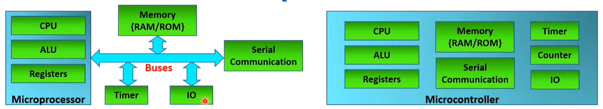
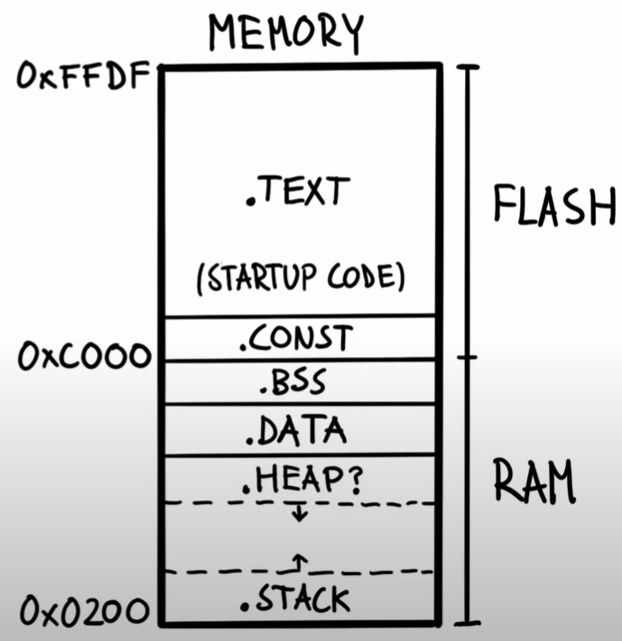

# Embedded Systems

# Types of Embedded Systems

---

1. **Bare Metal Embedded Systems:**
    - **Characteristics:** In a bare metal embedded system, the software runs directly on the hardware without any intervening operating system.
    - **Control:** Developers have full control over hardware resources, making it highly efficient for specific tasks.
    - **Use Cases:** Commonly used for real-time and performance-critical applications where low-level hardware control is essential, such as microcontroller-based systems or firmware in IoT devices.
    - **Pros:** Minimal resource overhead, deterministic response times, and direct access to hardware.
    - **Cons:** Requires extensive low-level programming, not suitable for complex multitasking, lacks built-in abstractions.
    - ********************Examples:******************** small-scale embedded systems, such as those found in household appliances, automotive components (like engine control units), and industrial sensors, Internet of Things (IoT) devices, like simple temperature sensors or smart light switches
2. **Real-Time Operating System (RTOS):**
    - **Characteristics:** RTOS is an operating system designed for embedded systems that require deterministic and predictable responses to events.
    - **Control:** Provides task scheduling, inter-task communication, and synchronization mechanisms to manage real-time tasks.
    - **Use Cases:** Suitable for applications where tasks must meet strict timing requirements, such as automotive systems, medical devices, and industrial automation.
    - **Pros:** Offers task management, priority scheduling, and real-time capabilities, simplifies multitasking and resource sharing.
    - **Cons:** Adds some overhead, may not be necessary for less time-critical applications.
    - **Examples**: Devices like infusion pumps, heart monitors, and MRI machines
3. **Embedded General-Purpose Operating System:**
    - **Characteristics:** These are operating systems adapted for resource-constrained embedded systems, often with a more general-purpose feature set.
    - **Control:** Provides a higher-level abstraction and is capable of multitasking, file systems, and networking.
    - **Use Cases:** Suitable for more complex embedded systems that require features like networking, file storage, or graphical user interfaces, such as smartphones, smart appliances, or consumer electronics.
    - **Pros:** Offers a wide range of features, supports application development with familiar programming models, and can speed up development.
    - **Cons:** Consumes more resources compared to bare metal or RTOS, may have less predictable real-time performance.
    - **Examples**: modern smart TVs run embedded Linux-based operating systems. These TVs require a more comprehensive OS to support features like internet connectivity, streaming, app installations, and graphical user interfaces.

**SUMMARY:**

- **Bare Metal** is low-level and efficient, ideal for resource-constrained and real-time applications that require direct hardware control.
- **RTOS** is designed for real-time applications with strict timing requirements, providing task management and synchronization.
- **Embedded General-Purpose OS** is adapted for more complex embedded systems with a broader feature set, suitable for applications requiring advanced functionality beyond real-time constraints.

# **Microcontrollers vs. Microprocessors vs. SOCs**

---

- **Microcontroller**: a compact integrated circuit designed to perform specific, predefined tasks in an embedded system. It contains a processor core, memory, and programmable input/output peripherals.

- **Microprocessor (a.k.a. CPU)**: the CPU of a computer. It's a standalone IC thats designed for general-purpose tasks.

- **System-on-Chip (SoC)**: integrates multiple components of a computer or electronic system into a single chip. It may include a microprocessor, memory, and various peripherals.

## Micro-Controller/Processor and SoC Comparison Table

---

| Aspect | Microcontroller | Microprocessor | System-on-Chip (SoC) |
| --- | --- | --- | --- |
| Definition | Compact IC for specific embedded tasks | Standalone CPU for general-purpose computing | Integrates multiple components into a single chip |
| Applications | Embedded systems (IoT, robotics, appliances) | General-purpose computing (desktops, laptops) | Compact electronic systems (smartphones, IoT devices) |
| Internal Structure | CPU core, RAM, ROM/Flash, peripherals

[CPU, ALU, Registers, Memory (RAM/ROM), Serial Communication ports, Timer, Counter, I/O ports] | CPU core, may include cache, relies on externals

[CPU, ALU, Registers (very costly cache memory L1/L2/L3)] | CPU or microcontroller core, GPU, RAM, peripherals

[CPU, ALU, Registers, Memory (RAM/ROM), GPU, Peripherals, I/O, Serial Communication, Timers and Counters, Power Management, Networking Components, Security Features, Analog Components] |
| Processing Power | Moderate, task-specific optimization | High, suitable for a wide range of computing tasks | Balanced for various applications |
| Memory | Limited RAM for data, Flash/ROM for programs | External RAM for data, external storage for programs | Integrated memory components, storage on the chip |
| Data Handling per Clock Cycle | Moderate, task-specific optimization | Significant, optimized for general-purpose computing | Varies based on the specific SoC design |
| Power Consumption | Designed for low power consumption | Variable, can be higher depending on the task | Designed to be power-efficient |
| Cost | Cost-effective, suitable for mass production | More expensive due to high processing capabilities | Cost-effective, considering integration |

# Architecture

---



## Harvard Architeure

---

Most embedded systems use HARVARD ARCHITECTURE, where the program memory and data memory are separated.

In Von Neumann architecture, program memory and data memory are integrated into a single memory space.

The Harvard architecture is often favored in microcontrollers because it provides certain advantages, such as:

1. **Parallel Access:** Harvard architecture allows the CPU to fetch an instruction from program memory and read or write data from or to data memory simultaneously. This can lead to more efficient and faster execution of instructions. This is achieved through the use of separate buses for program and data (not more cores)
2. **Specialized Applications:** The separation of program and data memory is well-suited for embedded systems and microcontroller applications, where fast and efficient access to both program instructions and data is essential.
3. **Simpler Instruction Fetch:** The separation of program memory and data memory simplifies the instruction fetch process, making it more straightforward and potentially faster.

# **Memory in Embedded Systems**

---

Memory in embedded systems can be divided into two categories:

- **Program Memory (typically non-volatile in embedded systems):**
    - **Flash Memory:** Commonly used for storing the program (firmware) in embedded systems. It is non-volatile memory, meaning it retains data even when power is turned off.
        - use case: firmware storage
            - NAND/NOR Flash
                
                ### **NAND Flash**
                
                - **Operation:**
                    - NAND flash is used for high-density data storage.
                    - It operates by storing data in memory cells connected in a series.
                - **Use Cases:**
                    - Mainly used in mass storage devices like USB drives, SSDs, and memory cards.
                - **Life Cycle:**
                    - NAND flash has a higher write endurance compared to NOR flash.
                    - Suited for applications with frequent write cycles.
                
                ### **NOR Flash**
                
                - **Operation:**
                    - NOR flash is used for code storage and direct execution.
                    - It operates by connecting memory cells in parallel.
                - **Use Cases:**
                    - Code storage in microcontrollers for direct execution.
                - **Life Cycle:**
                    - NOR flash has a lower write endurance compared to NAND flash.
                    - Suitable for applications with less frequent write cycles.
    - **ROM (Read-Only Memory):** Another non-volatile memory type used for storing fixed and unchangeable program instructions.
        - use case: ROM-based boot-loader (a small piece of code that initializes the system and loads the main firmware or operating system into memory.)
- **Data Memory (can be volatile or non-volatile):**
    - **SRAM (Static Random-Access Memory):** Volatile memory that is fast but loses its contents when power is turned off. Used for temporary data storage.
        - use case: cache memory close to the microcontroller's processor core.
            - The cache stores copies of frequently accessed data from the main memory (RAM) to reduce the time it takes to fetch data during repeated access.
    - **EEPROM (Electrically Erasable Programmable Read-Only Memory):** Non-volatile memory used for storing small amounts of data that needs to be retained during power cycles.
        - use case: storing and retrieving non-volatile configuration data (or small amounts of user-specific information)
    
    ### Memory Diagram
    
    ---
    



In embedded systems, memory is often organized into different sections to manage various types of data and code. The names and characteristics of these sections can vary based on the toolchain and platform, but some common sections include:

1. **.TEXT Section:**
    - **Purpose:** This section holds the executable code (machine instructions) of the program.
    - **Attributes:** Read-only (code should not be modified during program execution).
    - **Typical Contents:** Program instructions, functions, and other executable code.
2. **.CONST Section:**
    - **Purpose:** This section holds constant data that does not change during program execution.
    - **Attributes:** Read-only (similar to .TEXT, data should not be modified).
    - **Typical Contents:** Constants, such as string literals or other immutable values.
3. **.BSS Section:**
    - **Purpose:** This section holds uninitialized or zero-initialized global and static variables.
    - **Attributes:** Read-write (memory is allocated but not initialized to a specific value).
    - **Typical Contents:** Global and static variables that are initialized to zero or remain uninitialized until explicitly set.
4. **.DATA Section:**
    - **Purpose:** This section holds initialized global and static variables.
    - **Attributes:** Read-write (memory is allocated and initialized to specific values).
    - **Typical Contents:** Global and static variables with explicit initial values.
5. **.HEAP Section:**
    - **Purpose:** This section is associated with dynamic memory allocation during program execution.
    - **Attributes:** Read-write (memory can be allocated and modified during runtime).
    - **Typical Contents:** Dynamically allocated memory using functions like **`malloc`** in C or **`new`** in C++.
6. **.STACK Section:**
    - **Purpose:** This section is used for managing the call stack during program execution.
    - **Attributes:** Read-write (memory is used for function call stack frames).
    - **Typical Contents:** Local variables, function parameters, return addresses, and other information related to function calls.
- Code with memory sectors
    
    ```c
    int a[5] = {0xAAAA, 0xBBBB, 0xCCCC, 0xDDDD}; // Global variable initialized {.data + .const} RAM + FLASH
    const int b[5] = {0xBBBB, 0xBBBB, 0xBBBB, 0xBBBB}; // Constant variable {.const} FLASH
    int c[5]; // Global variable not initialized {.bss} RAM
    
    void main(void) {
    	int d[5] = {0xBBBB, 0xBBBB, 0xBBBB, 0xBBBB}; // Local variable initialized {.stack + .const} RAM + FLASH
    	// ^ local variable is allocated (on the stack) when we enter the function
    	// the data values are stored in the flash in the const section
    	// the copy instructions (to copy the data values to d[] are stored in .text)
    
    	static int e[5] = { 0xEEEE, 0xEEEE, 0xEEEE, 0xEEEE}; // Static variable initialized {.data + .const} RAM + FLASH
    
    	int sum = 0; // Local variable initialized {.stack} RAM
    	for (int i = 0; i < 5; i++) { // program code {.text} FLASH
    		sum += a[i] + b[i] + c[i] + d[i] + e[i]; // program code {.text} FLASH
    	}
    }
    ```
    
    }
    

## Memory **Characteristics and Considerations:**

---

1. **Volatility:**
    - **Volatile Memory:** Loses its data when power is turned off (e.g., SRAM).
    - **Non-Volatile Memory:** Retains data even when power is turned off (e.g., Flash, EEPROM).
2. **Speed:**
    - **Fast Memory:** Used for high-speed access, typically for data processing (e.g., SRAM).
    - **Slower Memory:** Used for long-term storage, often with slower access times (e.g., Flash).
3. **Endurance:**
    - **Write Endurance:** Flash memory has a limited number of write cycles before it may fail. Careful management is needed to prevent premature wear.
4. **Capacity:**
    - **Program Memory:** Typically larger to accommodate the firmware or software.
    - **Data Memory:** Can vary in size based on the application's requirements.
5. **Cost:**
    - **Cost-Effective Memory:** Depending on the application, the cost of memory can be a critical factor.
6. **Power Consumption:**
    - **Low Power Memory:** Important for battery-powered or energy-efficient embedded systems.

## **Memory Management Strategies:**

---

1. **Memory Mapping:**
    - Allocating specific memory regions for different purposes, such as program storage, data storage, and memory-mapped I/O.
2. **Memory Pools:**
    - Allocating fixed-size blocks of memory to optimize memory usage.
3. **Caching:**
    - Using caches to improve access times for frequently used data.
4. **Dynamic Memory Allocation:**
    - Managing memory dynamically during runtime, commonly using heap memory.

## **Challenges in Embedded Systems Memory Management:**

---

1. **Limited Resources:**
    - Embedded systems often have constrained resources, making efficient memory usage crucial.
2. **Real-time Constraints:**
    - Some embedded systems have real-time requirements, necessitating careful consideration of memory access times.
3. **Power Constraints:**
    - Power-efficient memory usage is critical for battery-powered embedded systems.
4. **Write Endurance (for Flash Memory):**
    - Managing write endurance to prevent premature failure of Flash memory.

# Miscellaneous Notes

---

## Synchronous Communication

---

Synchronous communication in embedded systems refers to a mode of data transfer where **the sender and receiver devices use a shared clock signal to coordinate the timing of data transmission and reception**. In synchronous communication, data is transferred in sync with this clock signal, ensuring that both the sender and receiver operate at the same rate and timing.

## Half/Full Duplex Communication

---

There are two main types of duplex communication:

1. **Full-Duplex (both ways, simultaneous):** In a full-duplex communication system, data can be transmitted in both directions **simultaneously**. This means that two devices can send and receive data from each other at the same time, like a phone conversation where both parties can speak and listen simultaneously. Full-duplex communication typically requires separate communication channels for transmitting and receiving data, such as separate wires or frequency bands.
2. **Half-Duplex (both ways, NOT simultaneous):** In a half-duplex communication system, data can be transmitted in both directions, but not simultaneously. Devices take turns sending and receiving data. While one device is transmitting, the other must wait to receive, and vice versa. It's like a walkie-talkie communication where you press a button to talk and release it to listen. Half-duplex communication often uses a shared communication channel.

## Pulling-Up Data Lines

---

"Pulling up" a data line (wire) means applying a voltage to the line to ensure that it defaults to a known logic level when it is not actively being driven by a device. This is done using a resistor called a "pull-up resistor."

Here's how it works:

1. **Default Logic Level**: In many digital communication protocols like I2C, lines are meant to be in one of two logic states: high (1) or low (0). When no device is actively driving the line (i.e., when the line is in a high-impedance state), it can "float" and take on any voltage level, which might be interpreted as an unintended signal by other devices on the bus.
2. **Pull-Up Resistor**: To prevent this floating and to ensure a default logic level, a pull-up resistor is connected between the data line (e.g., SDA or SCL) and the supply voltage (Vcc). This resistor "pulls up" the voltage level on the line to Vcc when no device is driving it.
3. **Pull-Up Strength**: The value of the pull-up resistor determines the "strength" of the pull-up. A lower resistor value results in a stronger pull-up and a faster rise time, but it also consumes more power. A higher resistor value results in a weaker pull-up and a slower rise time but conserves more power.
4. **Active Devices**: When a device actively drives the data line low (0), it can easily overcome the pull-up resistor's influence and pull the line to a low logic level. When the device releases the line (goes to high-impedance state), the pull-up resistor brings the line back to the default high logic level (1).

In summary, pulling up a data line in embedded systems **ensures that the line maintains a known logic level when it's not actively being driven by a device, preventing ambiguous or unintended signals on the communication bus**. This is essential for reliable and **noise-immune** communication between devices.

## Direct Memory Access (DMA)

---

DMA (Direct Memory Access) in embedded system engineering is a hardware feature that enables peripherals and memory to communicate directly without involving the CPU, thereby improving system efficiency and reducing CPU overhead.

Here's how DMA works:

1. **Initialization**: The CPU configures the DMA controller by specifying the source and destination memory addresses, the data transfer size, and the transfer direction (read from source to destination or write from source to destination).
2. **Request**: When a peripheral device (e.g., ADC, UART, or memory) needs to transfer data, it sends a request signal to the DMA controller.
3. **Arbitration**: If multiple peripherals request DMA access simultaneously, the DMA controller typically arbitrates between them to determine which one gets access based on priority or a predefined scheme.
4. **Data Transfer**: The DMA controller gains control of the system bus and accesses the source data from the peripheral and the destination memory location. It transfers data directly between them without CPU intervention.
5. **Completion**: Once the data transfer is complete, the DMA controller may generate an interrupt to notify the CPU. The CPU can then process the data or perform other tasks.

DMA benefits embedded systems by reducing CPU workload and improving overall system performance, especially in scenarios where data needs to be transferred continuously or in large chunks. It's commonly used in scenarios like audio processing, data logging, and communication protocols where efficient data handling is crucial.

## **Semaphores (int) and Mutexes (bool)**

---

**Semaphores and Mutexes** are synchronization mechanisms used in embedded systems to control access to shared resources and coordinate the execution of multiple tasks or threads. While they serve similar purposes, they have distinct differences and are suited for different scenarios.

**Semaphores:**

- **Definition:** Semaphores are a synchronization primitive that maintains a count to control access to a resource or limit the number of tasks/threads that can access it simultaneously.
- **Advantages:**
    - **Counting Mechanism:** Semaphores can allow a specified number of tasks/threads to access a resource concurrently, which is useful for scenarios where you want to control resource access based on availability.
    - **Flexible Use:** They can be used for more complex synchronization patterns like producer-consumer problems and controlling access to a pool of resources.
- **Disadvantages:**
    - **Complexity:** Semaphores can lead to complex code, especially when dealing with multiple semaphore instances and intricate synchronization patterns.
- **When to Use Semaphores:**
    - Use semaphores when you need to control access to a resource based on a count, or when you want to implement more advanced synchronization patterns involving multiple tasks/threads.

**Mutexes (Mutual Exclusion):**

- **Definition:** Mutexes are a synchronization mechanism that allows only one task/thread to access a resource at a time, ensuring exclusive access and preventing data corruption due to concurrent access.
- **Advantages:**
    - **Simplicity:** Mutexes are straightforward to use and understand. They ensure that only one task/thread can access a resource, reducing the complexity of synchronization.
    - **Data Protection:** They are particularly useful when protecting critical sections of code or shared data structures that should not be accessed concurrently.
- **Disadvantages:**
    - **Potential Deadlocks:** Incorrect usage of mutexes can lead to deadlocks if tasks/threads do not release the mutex properly, causing the system to become unresponsive.
- **When to Use Mutexes:**
    - Use mutexes when you need to protect critical sections of code or shared resources to ensure that only one task/thread can access them at a time. Mutexes are ideal for scenarios where exclusive access is required.

In summary, semaphores are more suitable when you need to control access to resources based on a count or implement complex synchronization patterns, while mutexes are ideal for ensuring exclusive access to shared resources or critical sections of code. The choice between them depends on the specific requirements of your embedded system's design.

# Resources

---

This project allows a user to control a Linux system (via sockets) from their phone:

[https://github.com/M-EMBABI/Pc-remote-control](https://github.com/M-EMBABI/Pc-remote-control)

## Citations and Thank Yous

---

These notes were made possible by these wonderful playlists/courses on youtube (and some help formatting/paraphrasing by ChatGPT):

****************************************************************Complete Playlist on Embedded Systems:****************************************************************

[https://www.youtube.com/playlist?list=PLcbIZiT62e1gNZ-VWPO3rpTpXkHBMZa2n](https://www.youtube.com/playlist?list=PLcbIZiT62e1gNZ-VWPO3rpTpXkHBMZa2n)

******Difference between Microprocessor and Microcontroller:******

[https://youtu.be/dcNk0urQsQM?si=F7hW-ExY30v4OQQT](https://youtu.be/dcNk0urQsQM?si=F7hW-ExY30v4OQQT)

[https://youtu.be/QGg5jZEdT7A?si=f-vb0x_V-pRNWiFZ](https://youtu.be/QGg5jZEdT7A?si=f-vb0x_V-pRNWiFZ)

****Different Types of Memory in Microcontroller : Flash Memory, SRAM and EEPROM:****

[https://youtu.be/4WnTTL_7a1g?si=Qbi6nt5dB8eSz__L](https://youtu.be/4WnTTL_7a1g?si=Qbi6nt5dB8eSz__L)

**How Microcontroller Memory Works:**

[https://youtu.be/hyIEUCIVhQQ?si=OeAjQ1nIsdBWlbnr](https://youtu.be/hyIEUCIVhQQ?si=OeAjQ1nIsdBWlbnr)
