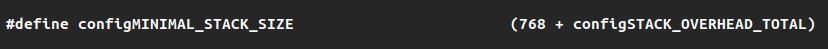
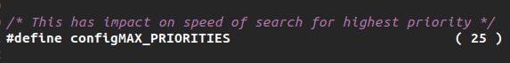
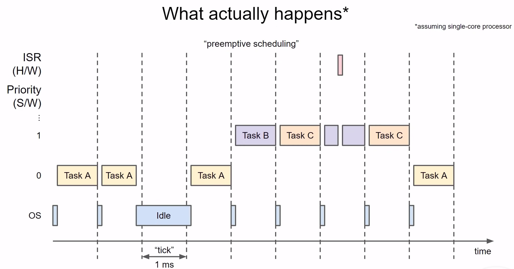
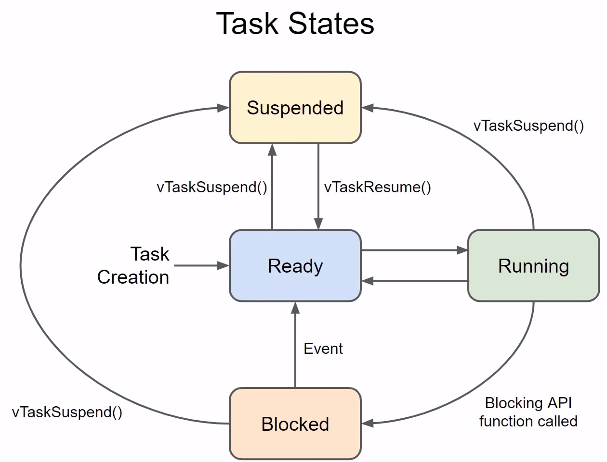

# Real-Time Operating Systems (RTOS)

---

A real-time operating system (RTOS) is a specialized software designed to **manage and execute tasks with precise timing and responsiveness in real-time applications**. 

RTOS prioritizes tasks based on their urgency, providing a predictable and deterministic environment for applications where timing is crucial.

## Getting Started with ESP32 on Arduino IDE

---

1. Download the FreeRTOS source code at freertos.org
2. In Arduino IDE, select “File” → “Preferences” → URL List button → Enter: “`https://dl.espressif.com/dl/package_esp32_index.json`” (this file contains the board definition and configurations)
3. “Tools” → “Board” → “Boards Manager” → Search for “esp32” and select the esp32 package by Espressif Systems → Install most recent version
4. Once install completes, exit and reload the Arduino IDE (Restarting the application allows it to reload its configuration, recognize the newly installed board support, and make the added features and boards accessible within the IDE.)
5. If you want to view how FreeRTOS is configured on the esp32, you can view `FreeRTOSConfig.h` . If the Arduino IDE was installed from the home directory, this configuration file is likely found in:
`/home/user/.arduino15/packages/esp32/hardware/esp32/2.0.11/tools/sdk/esp32/include/freertos/include/esp_additions/freertos/FreeRTOSConfig.h`

For example, this configuration file defines the maximum number of priority levels available for a developer to use and the smallest task stack size we can set:

## RTOS Tick Timer

---

A tick timer is used to **measure time** and **schedule tasks**. 

The tick timer generates regular interrupts at fixed intervals, known as ticks. These ticks serve as a basis for the RTOS to **keep track of time and manage task scheduling**

The tick timer interval is determined by the configuration of the RTOS kernel during initialization (this is defined in FreeRTOSConfig.h for FreeRTOS).

## FreeRTOS Tasks

---

A task in FreeRTOS is an **independent and concurrently executing unit of code** that represents a thread of execution with its **own stack and priority**, providing a way to implement multitasking.

### The Task Scheduler

An RTOS task scheduler manages the execution of tasks in a system with multiple tasks. It assigns priorities to tasks and uses a scheduling algorithm to determine which task to run based on their priorities and states. **The scheduler regularly interrupts the CPU at a fixed rate (system tick), allowing it to make decisions on task switching**. Tasks transition between states such as Ready, Running, and Blocked, and the scheduler ensures that the highest-priority ready task runs, promoting a responsive and deterministic system.

**In a multi-core system, the task scheduler may choose to put some tasks on another core.** 

### Task Function Prototype

`void vTaskFunction(void *pvParameters);`

### Task Handles

A task handle is a **reference or identifier used to uniquely identify and manage a specific task**.

The task handle is returned by the FreeRTOS API functions that create tasks and is then used in other API functions to perform operations on the specific task.

### Task States

1. **Blocked:** A task is waiting for an event, such as waiting for a semaphore, a message in a queue, or a timer to expire. The task remains in the Blocked state until the event occurs. A task is NOT in the blocked state if it is waiting for a higher priority task to finish running (it is in the ready state)
2. **Ready:** A task is eligible to run but has not been selected by the scheduler yet. The scheduler can move a task from the Ready state to the Running state when it decides to execute the task. When a task is created it automatically enters the ready state 
3. **Running:** A task is currently being executed by the CPU. Only one task can be in the Running state at any given time.
4. **Suspended:** A task has been explicitly suspended using the vTaskSuspend() function. A suspended task is not eligible to run until it is resumed using the vTaskResume() function.
5. **Deleted:** A task has been explicitly deleted using the vTaskDelete() function. Once deleted, the task no longer exists, and its resources are released.
6. **Interrupt Service Routine (ISR):** FreeRTOS distinguishes between tasks that run in the context of an ISR and tasks that run in the context of a regular thread. An ISR task is typically a high-priority task that runs in response to an interrupt.

## Context

---

An RTOS context refers to the c**omplete state of a task at a specific point in time, including its program counter, register values, and stack contents**. The context allows the task to be paused and later resumed, ensuring efficient multitasking in a real-time operating system.

### Context Switching

Context switching is the process in which **the operating system saves the current state (context) of a running task, allowing it to later resume from that point**. Simultaneously, the system loads and activates the context of another task, enabling seamless and rapid transitions between multiple tasks in a multitasking environment, such as an RTOS.

## Task Control Block (TCB)

---

The TCB is a data structure used by the operating system to manage and control individual tasks or threads. Each task in an RTOS has its own TCB, and the **TCB contains information about the task's state, priority, context, and other relevant details.**

The Task Control Block typically includes the following information:

1. **Task ID or Handle:** A unique identifier for the task within the operating system.
2. **Task State:** Indicates whether the task is ready, running, blocked, or in another state.
3. **Task Priority:** The priority assigned to the task, which determines its scheduling order.
4. **Program Counter (PC):** The address of the next instruction to be executed when the task is scheduled.
5. **Stack Pointer (SP):** Points to the current position on the task's stack. The stack is used to store local variables, function call information, and the task's context.
6. **Task Stack:** The memory allocated for the task's stack.
7. **Task Context:** Additional register values and processor-specific context information needed to restore the task's state when it is scheduled.
8. **Task Name or Identifier:** A human-readable name or identifier for the task, which can be useful for debugging and logging.

The TCB is managed by the RTOS kernel, and the information within the TCB is updated as the task transitions between different states (e.g., from ready to running, from running to blocked). The TCB allows the RTOS to efficiently **switch between tasks, save and restore their states, and manage their execution in a real-time environment**.

The TCB allows the RTOS to efficiently switch between tasks, save and restore their states, and manage their execution in a real-time environment.

## FreeRTOS Memory Management

---

### Heap Allocation Schemes

The heap allocation schemes determine how FreeRTOS allocates and manages memory for dynamic objects such as tasks, queues, semaphores, and other kernel objects. Here are the primary heap allocation schemes provided by FreeRTOS:

1. **Heap_1:**
    - **Description:** Implements a simple, static memory allocation scheme using a fixed-size buffer.
    - **Configuration:** The buffer size is set at compile-time using the **`configTOTAL_HEAP_SIZE`** configuration parameter.
2. **Heap_2:**
    - **Description:** A dynamic memory allocation scheme that uses a best-fit algorithm for allocating memory blocks.
    - **Configuration:** Memory allocation can be configured to use **`malloc`** and **`free`** provided by the standard C library or overridden with alternative functions.
3. **Heap_3:**
    - **Description:** Another dynamic memory allocation scheme, similar to Heap_2, but uses a first-fit algorithm.
    - **Configuration:** Like Heap_2, it can use either standard **`malloc`** and **`free`** or custom memory allocation functions.
4. **Heap_4:**
    - **Description:** A memory allocation scheme that provides thread-safe memory allocation using a single memory partition.
    - **Configuration:** Configured using **`configTOTAL_HEAP_SIZE`** and **`configAPPLICATION_ALLOCATED_HEAP`** parameters.
5. **Heap_5:**
    - **Description:** A memory allocation scheme designed for use with memory protection units (MPU) or memory region protection mechanisms. It provides segregated memory spaces for tasks and kernel objects.
    - **Configuration:** Uses the **`configTOTAL_HEAP_SIZE`** parameter and allows the definition of separate sizes for task and kernel object memory.
6. **Heap_6:**
    - **Description:** Similar to Heap_4 but provides an additional optional hook function (**`vApplicationGetIdleTaskMemory()`**) to allocate memory for the idle task.
    - **Configuration:** Uses **`configTOTAL_HEAP_SIZE`** and **`configAPPLICATION_ALLOCATED_HEAP`** parameters.

To configure the heap allocation scheme in FreeRTOS, you can define the appropriate macro in the FreeRTOS configuration file (typically named FreeRTOSConfig.h). For example, to use Heap_4, you would define **`configUSE_HEAP4`** in the configuration file.

## Citations and Thank Yous

---

These notes were made possible by this wonderful playlist on youtube (and some help formatting/paraphrasing by ChatGPT):

**RTOS Based Systems Playlist:**

[https://www.youtube.com/playlist?list=PLEBQazB0HUyQ4hAPU1cJED6t3DU0h34bz](https://www.youtube.com/playlist?list=PLEBQazB0HUyQ4hAPU1cJED6t3DU0h34bz)
